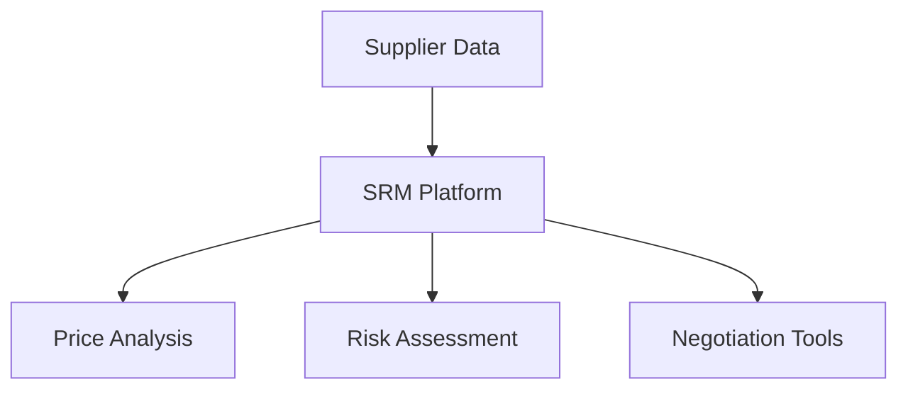
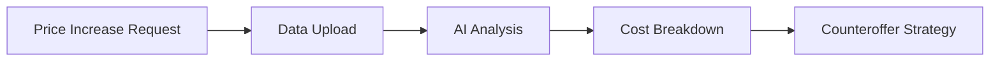

# 🚗 Supplier Resilience Manager (SRM) - MVP 🛠️
## 🏷️ ALPHA (Closed Source Testing) | v0.5

🌟 **A cutting-edge solution for automotive supply chain management and price negotiation**

---

## 🛠️ Tech Stack & Performance

<div align="center">
  
  
  
  
  
  
</div>


### ⚡ Why We Chose Bun.js

Bun.js is revolutionizing the JavaScript ecosystem with its incredible performance:

| Operation          | Bun.js 🚀 | NPM 🐢 | Speed Improvement |
|--------------------|----------|-------|-------------------|
| Package Install    | 0.5s     | 5s    | 10x faster        |
| Cold Start         | 50ms     | 200ms | 4x faster         |
| Hot Reload         | 10ms     | 100ms | 10x faster        |
| Memory Usage       | 50MB     | 150MB | 3x more efficient |

**Key Advantages:**
- 🚀 Built-in TypeScript support
- 🔥 Native bundler and test runner
- ⚡ Lightning-fast package management
- 🛠️ Simplified development workflow

---

## 📌 Overview

The Supplier Resilience Manager (SRM) is a data-driven platform designed to empower automotive manufacturers in supplier negotiations. Our MVP focuses on providing actionable insights and tools for managing supplier relationships effectively.



---

## 🎯 Current Features

### 📊 Dashboard Interface
- Real-time supplier performance metrics
- Interactive data visualization
- Dark mode support 🌙

### 🗺️ Geographic Insights
- Google Maps integration for supplier locations
- Supply chain route optimization

### 📈 Data Management
- Dataset integration (CSV, JSON)
- Random data generation for testing
- Alert message configuration

### 🛠️ Technical Stack
- React.js with Vite build tool
- Tailwind CSS for styling
- Context API for state management

---

## 🔮 Future Enhancements (Client Requirements)

### 🚨 Core Functionality


### ✅ Planned Features
1. **Input Data Functionality** 📥
   - Standardized upload format for price increase requests
   - Component details, old/new prices, supplier justification

2. **AI-Powered Analysis** 🤖
   - Raw material price trend comparison
   - Labor and energy cost analysis
   - Historical supplier behavior tracking

3. **Cost Breakdown Analysis** 🔍
   - Reverse engineering of supplier cost structures
   - Discrepancy flagging system

4. **Counteroffer Strategy Generator** 💡
   - Automated negotiation arguments
   - Market comparison tools
   - Contract compliance verification

---

## 🛠️ Installation & Setup

1. Clone the repository:
   ```bash
   git clone https://github.com/your-repo/SRM.git
   ```
2. Install dependencies:
   ```bash
   bun install
   ```
3. Start development server:
   ```bash
   bun run dev
   ```

---

## 📂 Project Structure

```
SRM/
├── src/
│   ├── components/       # Reusable UI components
│   ├── pages/            # Application views
│   ├── context/          # State management
│   ├── dataset/          # Sample data files
│   ├── model/            # Machine learning models
│   └── styles/           # Custom CSS files
├── public/               # Static assets
└── build/                # Production build
```

---

## 🤝 Contributing

We welcome contributions! Please follow these steps:
1. Fork the repository
2. Create your feature branch (`git checkout -b feature/AmazingFeature`)
3. Commit your changes (`git commit -m 'Add some AmazingFeature'`)
4. Push to the branch (`git push origin feature/AmazingFeature`)
5. Open a Pull Request

---

## 📜 License

This project is licensed under the MIT License - see the [LICENSE](LICENSE) file for details.

---

## ✉️ Contact

For inquiries or support, please contact:
- **Email**: haidertheofficial@gmail.com
- **Phone**: +923707350051
